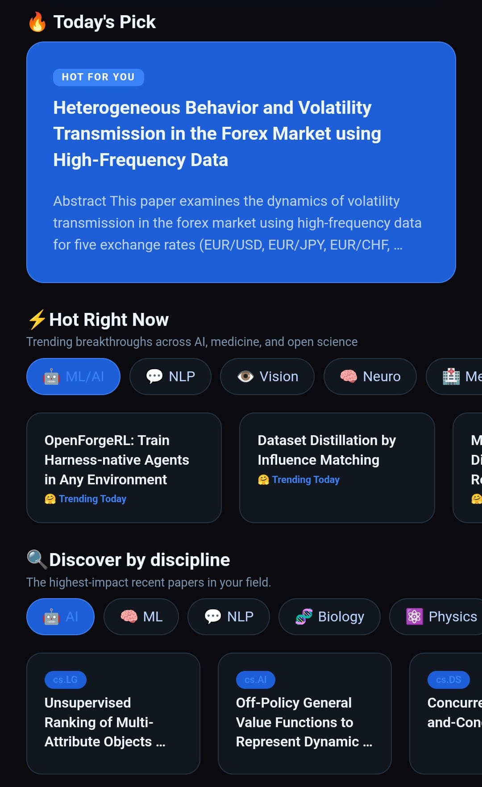
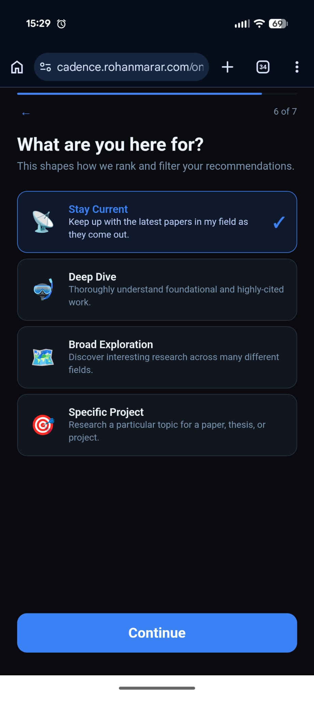
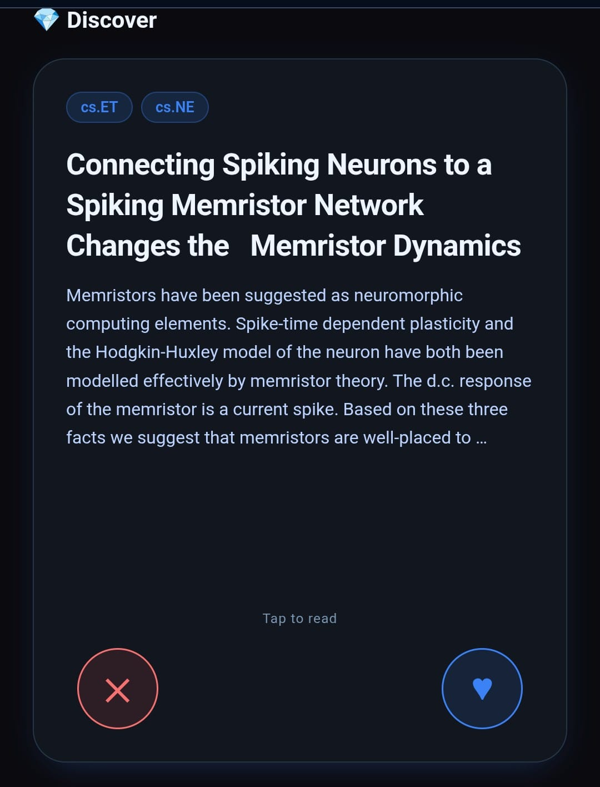
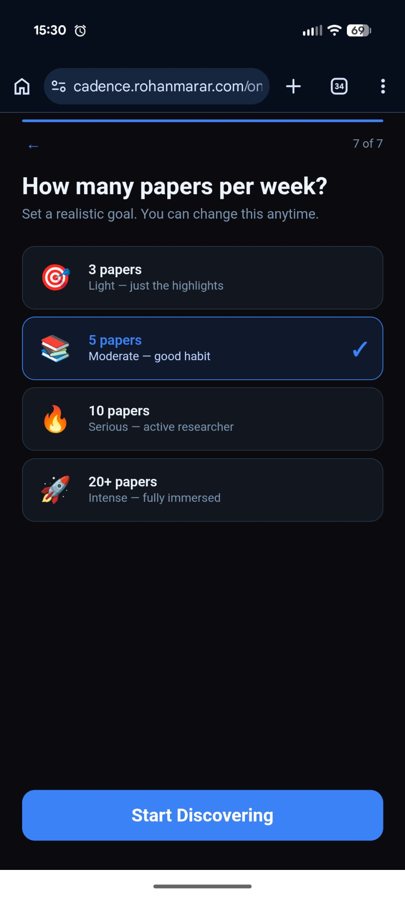
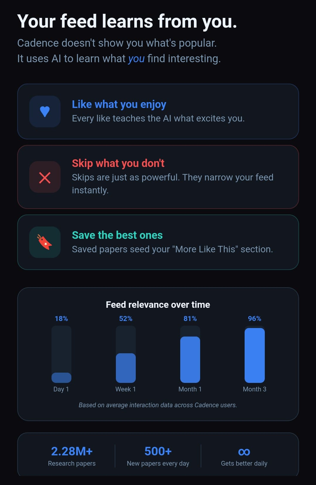

# Cadence App Frontend

> AI-powered research paper discovery — React Native + Expo PWA(progressive web app) hosted on Github Pages

[](LICENSE)
[](https://expo.dev)
[](https://reactnative.dev)

The Cadence frontend — a cross-platform React Native app with a PWA web export. Works on iOS, Android, and any browser. Installable on any device without an app store.

**Live PWA demo :** [cadence.rohanmarar.com](https://cadence.rohanmarar.com)  
**Backend repo:** [github.com/Rohan5manza/cadence-backend](https://github.com/Rohan5manza/cadence-backend)

---

## Features

- **Swipe-based discovery** — like, skip, save papers to train your feed
- **Personalized feed** — AI learns your taste from every interaction
- **Today's Pick** — one curated paper per day, consistent all day
- **Hot Right Now** — trending from HuggingFace + Semantic Scholar
- **Full paper reading** — open access PDFs in-app
- **Reading streaks** — daily reading habit tracking with notifications
- **Library + playlists** — save and organize papers
- **Comprehensive onboarding** — 9-step profile setup for cold-start personalization
- **PWA** — installable on desktop, mobile, any OS

---





## Quick Start

### Prerequisites

- Node.js 20+
- npm or yarn
- Expo CLI (`npm install -g expo-cli`)
- A running [cadence-backend](https://github.com/Rohan5manza/cadence-backend) instance

### Install

```bash
git clone https://github.com/Rohan5manza/cadence-app.git
cd cadence-app
npm install
```

### Configure API endpoint

In `services/api.ts`, update the base URL:

```typescript
const API_BASE = 'https://your-cadence-api-domain.com'
```

### Run

```bash
# Start development server
npx expo start

# Run on iOS simulator
npx expo run:ios

# Run on Android emulator
npx expo run:android

# Build web PWA
npx expo export --platform web
```

---

## Repository Structure

```
cadence-app/
│
├── app/                          # Expo Router pages
│   ├── _layout.tsx               # Root layout — loads auth state on startup
│   ├── index.tsx                 # Entry point — auth check + redirect
│   ├── auth.tsx                  # Login / Register screen
│   ├── onboarding.tsx            # 9-step onboarding flow
│   │
│   ├── (tabs)/                   # Tab navigation
│   │   ├── _layout.tsx           # Tab layout — sidebar on desktop, bottom tabs on mobile
│   │   ├── home.tsx              # Home screen — discover cards + all sections
│   │   ├── feed.tsx              # Feed tab — sorted paper list with sort chips
│   │   ├── search.tsx            # Search tab
│   │   ├── library.tsx           # Library — saved papers + playlists
│   │   └── profile.tsx           # Profile + preferences editor
│   │
│   ├── paper/
│   │   ├── [id].tsx              # Paper detail — metadata + actions
│   │   ├── read.tsx              # Full paper reading mode
│   │   └── similar.tsx           # Similar papers
│   │
│   └── playlist/
│       └── [id].tsx              # Playlist detail
│
├── assets/
│   └── images/
│       ├── cadence-icon.png      # App icon (1024×1024)
│       └── logo-glow.png         # Logo variant
│
├── constants/
│   └── index.ts                  # Colors, Fonts, Spacing, ROLES, TOPICS, etc.
│
├── scripts/                      # PWA build helpers
│   ├── manifest.json             # PWA manifest template
│   ├── post-build.sh             # Run after expo export — injects manifest + sw
│   └── sw.js                     # Service worker
│
├── services/
│   ├── api.ts                    # All API calls — feedAPI, papersAPI, authAPI, etc.
│   └── notifications.ts          # Push notifications (web-safe with null guards)
│
├── store/
│   └── useStore.ts               # Zustand store — auth, preferences, streak, history
│
├── types/
│   └── index.ts                  # TypeScript interfaces — Paper, User, Playlist, etc.
│
├── app.json                      # Expo config — icons, splash, bundle IDs, PWA settings
├── eas.json                      # EAS Build profiles — development, preview, production
├── package.json                  # Dependencies
├── tsconfig.json                 # TypeScript config
├── expo-env.d.ts                 # Expo TypeScript declarations
├── LICENSE                       # MIT License
└── README.md                     # This file
```

---

## Key Files Explained

### `app/_layout.tsx` — Root Layout

Runs on every page load. Loads auth token, preferences, history, streak from storage before rendering anything. Shows a loading spinner until storage is ready. This prevents race conditions where API calls fire before the token is set.

```typescript
// On every page load:
await Promise.all([
  loadStoredToken(),   // restore JWT from localStorage/SecureStore
  loadPreferences(),   // restore user profile
  loadHistory(),       // restore recent papers
  loadStreak(),        // restore reading streak
])
```

### `app/index.tsx` — Entry Point

After root layout loads, redirects to:
- `/auth` if no valid token
- `/onboarding` if token exists but onboarding not done
- `/(tabs)/home` otherwise

### `app/(tabs)/_layout.tsx` — Responsive Navigation

- **Desktop/wide (≥768px):** Left sidebar with logo + nav items
- **Mobile/narrow (<768px):** Bottom tab bar
- **Native iOS/Android:** Bottom tab bar always

Uses `Dimensions.get('window').width` to detect at render time.

### `app/(tabs)/home.tsx` — Home Screen

The most complex screen. Contains:

- **Discover card stack** — swipeable cards with gesture handling
  - Swipe right = like (`feedAPI.logInteraction({type: 'like'})`)
  - Swipe left = skip (`feedAPI.logInteraction({type: 'skip'})`)
  - Tap = navigate to paper detail
- **Today's Pick** — cached in localStorage by date, guaranteed consistent all day
- **♥ Liked by You** — from `feedAPI.getLiked()`
- **Recently Read** — from local history store
- **More of What You Like** — from `feedAPI.getSimilarToSaved()`
- **Mixed for You** — shuffled discover papers
- **Trending by Genre** — genre chips + `feedAPI.getTrending(genre)`
- **✦ Made for You** — slice of discover papers
- **🌐 Hot Right Now** — from `feedAPI.getHot(category)` with category chips

### `app/(tabs)/feed.tsx` — Feed Tab

Sort chips: ✦ For You / 🕐 Latest / 🔥 Most Cited  
Each calls `feedAPI.getDiscover(sort)` with sort param.

### `app/paper/[id].tsx` — Paper Detail

Shows full paper metadata. Actions:
- **Read** → `paper/read.tsx`
- **Free PDF** → opens Unpaywall PDF in-app WebView / iframe
- **Find Paper** → opens DOI link in WebView / iframe
- **Save** → `libraryAPI.savePaper()`
- **Share** → native share sheet
- **Similar** → `paper/similar.tsx`

On web: uses `<iframe>` for in-page PDF viewing. On native: uses `react-native-webview`.

### `app/paper/read.tsx` — Reading Mode

Two modes:
- **Summary** — shows abstract + metadata in a scrollable view
- **Full Paper** — shows PDF/HTML version

Web: renders arXiv papers in iframe with Google Docs fallback for PDFs.  
iOS: uses WebView with arXiv HTML version for scrollability.  
Android: uses WebView with Google Docs viewer for PDFs.

Tracks reading time. After 60 seconds of reading, logs a `read` interaction and updates streak.

### `services/api.ts` — API Client

All API calls in one file. Uses axios with a JWT interceptor.

Key groups:
- `authAPI` — login, register
- `feedAPI` — discover, liked, trending, hot, todaysPick, logInteraction
- `papersAPI` — search, getById, similar, unpaywall, byAuthor
- `libraryAPI` — saved papers, playlists CRUD
- `userAPI` — profile get/update

### `store/useStore.ts` — State Management

Zustand store with web-safe storage wrapper:

```typescript
const storage = {
  getItem: (key) => Platform.OS === 'web'
    ? localStorage.getItem(key)     // web
    : SecureStore.getItemAsync(key), // native
  // ...
}
```

Auth token is also saved to cookies on web for PWA persistence across browser/PWA contexts.

### `services/notifications.ts` — Push Notifications

All notification functions are guarded with:
```typescript
let Notifications = null
try { Notifications = require('expo-notifications') } catch {}
// Every function: if (!Notifications) return
```

This allows the app to run in Expo Go and web environments where push notifications aren't supported, without crashing.

---

## Building for Production

### PWA (Web)

```bash
npx expo export --platform web
./scripts/post-build.sh  # adds manifest.json, sw.js, _redirects
# Deploy dist/ folder to Netlify, Vercel, or any static host
```

### Android APK

```bash
eas build --platform android --profile production
# Returns .aab for Play Store submission
```

### iOS (requires Apple Developer account)

```bash
eas build --platform ios --profile production
# Returns .ipa for App Store / TestFlight
```

---

## Environment Variables

No environment variables needed in the frontend. The API base URL is hardcoded in `services/api.ts`.

For production, update:
```typescript
// services/api.ts
const API_BASE = 'https://your-api-url.com'
```

---

## PWA Setup

The `scripts/post-build.sh` script runs after every `expo export` to add PWA support:

```bash
npx expo export --platform web && ./scripts/post-build.sh
```

What it does:
1. Auto-detects the hashed icon filename in `dist/assets/`
2. Generates `dist/manifest.json` with correct icon path
3. Copies `dist/sw.js` (service worker)
4. Injects `<link rel="manifest">` and Apple touch icon meta tags into `dist/index.html`
5. Creates `dist/_redirects` for Netlify SPA routing

---

## Contributing

See [CONTRIBUTING.md](CONTRIBUTING.md).

---

## License

MIT License.





